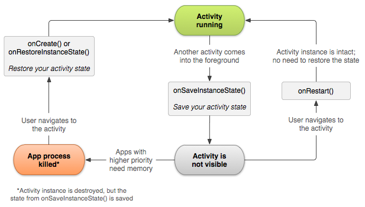
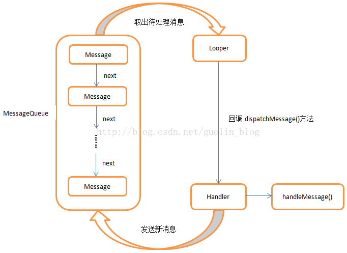
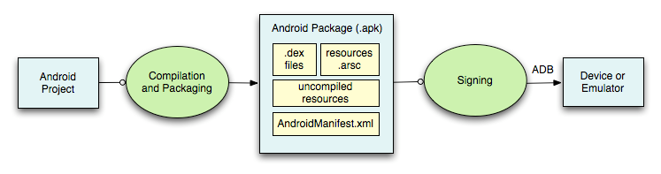
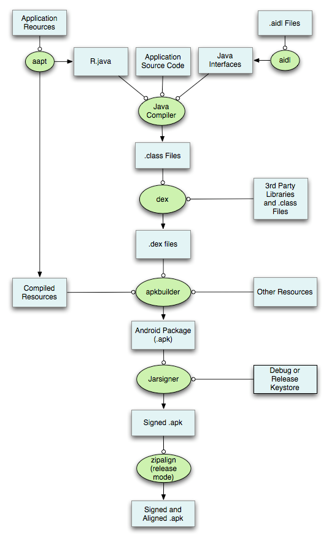

## Android Question List

> 基础

### 1.Activity生命周期

* 正常情况下的生命周期
  
* 复用Activity情况下的生命周期

onNewIntent，在Activity启动模式为SingleTop/SingleTask时，复用Activity时，会回调onNewIntent方法

* Activity异常销毁时的生命周期

系统会先调用 `onSaveInstanceState()`，然后再使 Activity 变得易于销毁。系统会向该方法传递一个 `Bundle`，您可以在其中使用 `putString()` 和 `putInt()` 等方法以名称-值对形式保存有关 Activity 状态的信息。然后，如果系统终止您的应用进程，并且用户返回您的 Activity，则系统会重建该 Activity，并将 `Bundle` 同时传递给 `onCreate()` 和 `onRestoreInstanceState()`。您可以使用上述任一方法从 `Bundle` 提取您保存的状态并恢复该 Activity 状态。如果没有状态信息需要恢复，则传递给您的 `Bundle` 是空值（如果是首次创建该 Activity，就会出现这种情况）。

 

### 2.Activity启动模式（LaunchMode）

### 3.ActivityThread

### 4.ActivityManagerService

### 5.Handler 、MessageQueue 、Looper三者的关系和原理



### 6.AsyncTask 、HanlderThread 、IntentService 的原理和使用场景

AsyncTask这个API已经废弃好多年不用了

顾名思义，HandlerThread就是一个自带Looper的Thread

IntentService，自带HanderThread的轻量级服务，在handleMessage中处理逻辑，handleMessage处理完成后自己会调用stopSelf结束服务。

使用场景的话，自从有了RxJava，我是真没想到AsyncTask有啥使用场景了。

### 7.IPC通信机制

1. Android进程间通信（IPC）的实现方式：Bundle，文件共享，AIDL，Messenger，ContentProvider，Socket，BroadCastReceiver
2. Android进程间通信（IPC）的机制：Binder Parcelable（此处不在叙述Serializable）Parcelable接口在完成数据的序列化过程之后，通过Binder进行传输。实质上Parcelable包含序列化和反序列化

- 那么问题还是来了，为啥需要多进程？如何实现多进程？
  - 为啥要多进程？
    1. Android对单个应用所使用的最大内存做了限制。
    2. 在不同的应用之间共享数 据。
- 如何实现多进程？Manifest清单文件中声明process属性
- WebView开发的时候为啥一般会指定独立进程？ 
  - WebView导致的OOM问题
  - Android版本不同，采用了不同的内核，兼容性Crash
  - WebView代码质量，WebView和Native版本不一致，导致Crash
- 最近两年的开发没有使用到AIDL和Binder，知识点记住，面试要能答上来，具体细节可以在使用的时候查询。   
- 详见“跟面试官讲Binder系列”

> Android View体系

### 1.View的工作原理/绘制过程

View的绘制工作是从ViewRoot的performTraversals方法开始，它经过measure/layout/draw三个过程才能最终将一个View绘制出来。ViewRoot对应于ViewRootImpl类，它是连接WindowManager和DecorView的纽带。View的三大流程均是通过ViewRoot来完成的。在ActivityThread中，当Activity对象被创建完毕后，会将DecorView添加到WIndow中，同时会创建ViewRootImpl对象，并将ViewRootImpl对象和DecorView建立关联。


### 2.Window View Activity三者的关系

追问Acitivty如何和Window关联

* Window

```
Abstract base class for a top-level window look and behavior policy.  An
instance of this class should be used as the top-level view added to the
window manager. It provides standard UI policies such as a background, title
area, default key processing, etc.
```

* View 负责实际绘制/显示内容
* Activity

Android中真正展示给用户的是window和view，activity在android中所的作用主要是处理一些逻辑问题，比如生命周期的管理、建立窗口等。在android中，窗口的管理还是比较重要的一块，因为他直接负责把内容展示给用户，并和用户进行交互。响应用户的输入等。 View是真正显示的矩形区域，DecorView是顶层View，也就是主View。 相互之间的关系可以理解为一个Activity包含了一个Window，这个Window其实是一个PhoneWindow，在PhoneWindow中包含了DecorView，变量名称为mDecor，mDecor有一个子View，这个子View的布局方式根据设定的主题来确定，在这个子View的xml布局中包含了一个FrameLayout元素，这个FrameLayout元素的id为content，这个content对应于PhoneWindow中的mContentParent变量，用户自定义的布局作为mContentParent的子View存在,一般情况下mContentParnet只有一个子View，如果在Activity调用addView方式实际上是给PhoneWindow中的mContentParent添加子View，由于mContentParent是一个FrameLayout,因此新的子view会覆盖通过setContentView添加的子view。

https://www.cnblogs.com/aademeng/articles/6538926.html

https://blog.csdn.net/ali18510953445/article/details/77915702

https://www.jianshu.com/p/049df709ddbf

* ViewRootImpl

ViewRoot 对应于ViewRootImpl类，View的三大流程都是通过ViewRoot来完成的。在ActivityThread中，当Activity对象被创建完毕之后，会将DecorView添加到Window中，同时会创建ViewRootImpl对象，并将ViewRootImpl对象和DecorView建立关联。

* DecorView 顶级View

### 3.自定义View的具体过程

对于自定义View来讲，重写onDraw，在onDraw方法中写入自己的绘制逻辑

对于自定义ViewGroup来讲，要根据自己的需求重新onMeasure方法，测量并计算子View的位置，然后重写onLayout方法，将计算好的位置传递给子View的layout方法，逐层递归调用

1. 自定义View已经基本掌握（精通），自定义ViewGroup的关键在于精通onMeasure中关于测量的方法和MeasureSpec的三种不同的模式，onLayout只是简单地把子View布置到该放置的地方，因此onMeasure是自定义ViewGroup的精髓所在。
2. 要精准地理解View绘制的流程/方法/概念。

### 4.onMeasure的具体过程，先measure子view还是自己

调用measureChildren去测量每一个子View的尺寸并记录，最后根据子View的尺寸来计算父View的尺寸，并调用父View的super.onMeasure/setMeasureDemension方法，将测量的结果保存

### 5.onDraw的具体过程，先draw子view还是自己

onDraw在整个绘制流程中，是用于绘制主体的方法，对于ViewGroup本身而言，onDraw方法是一个空实现，onDraw调用完成后，会调用dispatchDraw，递归地去调用子View的onDraw方法，绘制子View。

### 6.事件分发机制

关于事件分发机制，可以从两个角度讲解

* 其一是事件分发的原理和流程

其实质上，是从Activity向下逐层递归调用dispatchTouchEvent()方法，dispatchTouchEvent()本身是一个调度方法，其内部调用onInterceptTouchEvent，判断当前View是否要拦截该事件，如果不拦截，接着调用onTouchEvent，将事件向下分发，直到有子View返回true，消费该事件。

其中，onTouchEvent中，如果子View在该事件的action.DOWN事件返回了false，那么本次触摸以后的事件子View都不会收到

* 其二是处理事件冲突的具体思路：

1. 实现自定义触摸反馈，直接在onTouchEvent中处理事件就OK
2. 父View想要事件，直接在onInterceptTouchEvent中返回true进行拦截。此时，父View对给子View分发一个action.CANCEL的事件，通知子View恢复状态。
3. 子View不想要父View拦截，调用requestDisallowInterceptTouchEvent()方法，请求父View不要拦截，该方法只对本地事件有效。

### 7.Android Framework层有没有了解过，说说 Window 窗口添加的过程

https://www.jianshu.com/p/049df709ddbf

每一个Activity组件都有一个关联的Window对象，用来描述一个应用程序窗口。每一个应用程序窗口内部又包含有一个View对象，用来描述应用程序窗口的视图。上文分析了创建DecorView的过程，现在则要把DecorView添加到Window对象中。而要了解这个过程，我们首先要简单先了解一下Activity的创建过程：
 首先，在ActivityThread#handleLaunchActivity中启动Activity，在这里面会调用到Activity#onCreate方法，从而完成上面所述的DecorView创建动作，当onCreate()方法执行完毕，在handleLaunchActivity方法会继续调用到ActivityThread#handleResumeActivity方法，

先看①号代码处，实例化了ViewRootImpl类，接着，在②号代码处，调用ViewRootImpl#setView方法，并把DecorView作为参数传递进去，在这个方法内部，会通过跨进程的方式向WMS（WindowManagerService）发起一个调用，从而将DecorView最终添加到Window上，在这个过程中，ViewRootImpl、DecorView和WMS会彼此关联，至于详细过程这里不展开来说了。
 最后通过WMS调用ViewRootImpl#performTraverals方法开始View的测量、布局、绘制流程

### 8. 动画（主要是属性动画）

这块的内容从hencoder网站及笔记复习

### 9.RecyclerView 和 ListView 的相同和不同点，在 item 回收上有什么不同

* RecyclerView支持三种布局方式，更加灵活
  1. LinearLayoutManager，可以支持水平和竖直方向上滚动的列表。
  2. StaggeredGridLayoutManager，可以支持交叉网格风格的列表，类似于瀑布流或者Pinterest。
  3. GridLayoutManager，支持网格展示，可以水平或者竖直滚动，如展示图片的画廊。
* 实现item动画更方便，RecyclerView.ItemAnimator则被提供用于在RecyclerView添加、删除或移动item时处理动画效果
* RecyclerView.ItemDecoration可以更个性化地实现分割线
* 将测量和布局过程完全委托给LayoutManager

https://www.aliyun.com/jiaocheng/47916.html 

https://blog.csdn.net/qq_23012315/article/details/50807224

> 热点技术

### 1.热修复

https://www.jianshu.com/p/704cac3eb13d

### 2.插件化

### 3.模块化/组件化的原理，还有一些组件化平时使用的问题

### 4.消息推送有没有做过，推送到达率的问题

项目中使用的推送一般都是用第三方SDK，当然也可以自己写一个心跳。

至于推送到达率，海外的话，使用Firebase，不存在这个问题。

国内的话，只能寄希望于第三方SDK的策略，自己搭建推送服务，成本高，且到达率不易控制。到达率说白了根本还是进程保活，JobScheduler可以做一些后台任务。

> 架构

### 1.说说 apk 打包流程以及多渠道打包
多渠道打包这个非常easy了，重点说一下APK的结构和打包流程
https://www.jianshu.com/p/7c288a17cda8




### 2.MVC MVP MVVM的理解


### 3.应用程序崩溃统计以及数据分析


## 开源框架

### 1. OKHttp 责任链模式

### 2. Retrofit

### 3. Glide 图片加载的三级缓存机制 以及 Bitmap 优化

* 首先是with方法，参数为非Application时，调用的是with(Activity/Fragment)方法；当with方法传入的是Activity或者Fragment时，会创建一个隐藏的Fragment加载到Activity／Fragment上，用于保证Glide加载图片的生命周期和Actiivty／Fragment一致，当退出Activity/Fragment时，图片停止加载。

   

1. with：创建RequestManager，并根据传入参数，初始化好对应的生命周期
2. load：用于初始化好图片下载、图片解析、图片转换的各个对象，用于后续流程
3. into：在线程池中去执行EngineRunnale的run方法，用HttpURLConnection下载图片、用BitmapFactory.decodeStream完成解码、然后把Bitmap转换成可统一展示的GlideBitmapDrawable、最后通过Handler发消息，在主线程中给ImageView设置图片


内存缓存有两级 LruCache/DiskLruCache


### LinkedHashMap

HashMap和双向链表合二为一即是LinkedHashMap。所谓LinkedHashMap，其落脚点在HashMap，因此更准确地说，它是一个将所有Entry节点链入一个双向链表的HashMap。由于LinkedHashMap是HashMap的子类，所以LinkedHashMap自然会拥有HashMap的所有特性。比如，LinkedHashMap的元素存取过程基本与HashMap基本类似，只是在细节实现上稍有不同。当然，这是由LinkedHashMap本身的特性所决定的，因为它额外维护了一个双向链表用于保持迭代顺序。此外，LinkedHashMap可以很好的支持LRU算法，笔者在第七节便在LinkedHashMap的基础上实现了一个能够很好支持LRU的结构。

### 4. RxJava flatMap和map的作用

map操作符就是对数据源做一个映射，返回的还是一个对象

flatMap操作符是根据数据源，生成一个流，并这个流和当前的流merge合并

### 5.Dagger 2 什么是依赖注入？能说几个依赖注入的库么？你使用过哪些？


