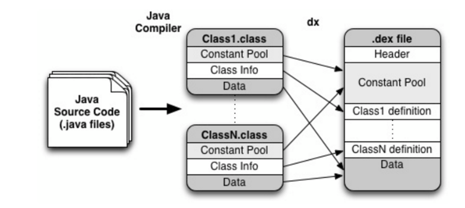
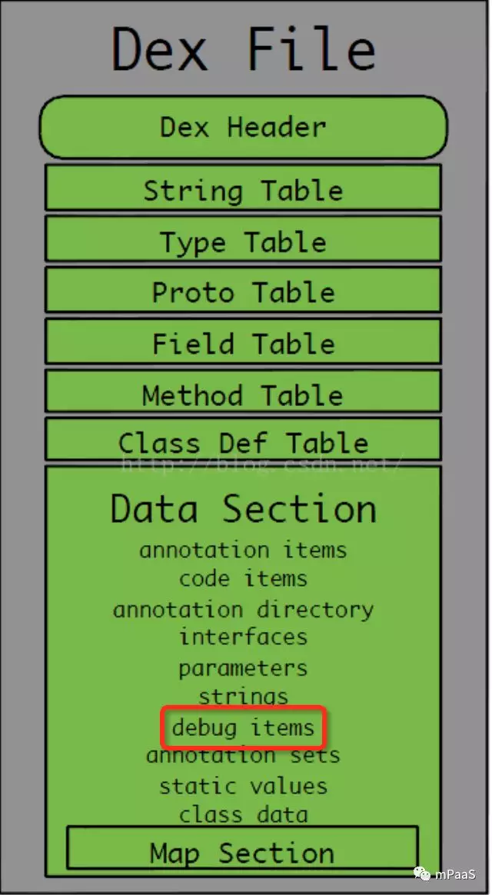

## Java字节码的dex文件结构

在讲详细方案前得稍微说说整个 Java 系的调试逻辑。
JVM 运行时加载的是 .class 文件，Android 为了使包大小更紧凑，并且运行更高效发明了 dalvik 和 art 虚拟机，两种虚拟机运行的都是 .dex 文件(当然 art 虚拟机还可以同时运行 oat 文件，不在本文章讨论范围)。
所以 dex 文件里面信息的内容和 class 文件包含的信息是完全一致的，不同的是 dex 文件对 class 中的信息做了去重，一个 dex 包含了很多的 class 文件，并且在结构上有比较大的差异，class 是流式的结构，dex 是分区结构，各个区块间通过 offset 索引。后面就只提 dex 的结构，不再提 class 的结构。dex 的结构可以用下面这张图表示：

文章链接

https://mp.weixin.qq.com/s/_gnT2kjqpfMFs0kqAg4Qig?utm_source=androidweekly.io&utm_medium=website